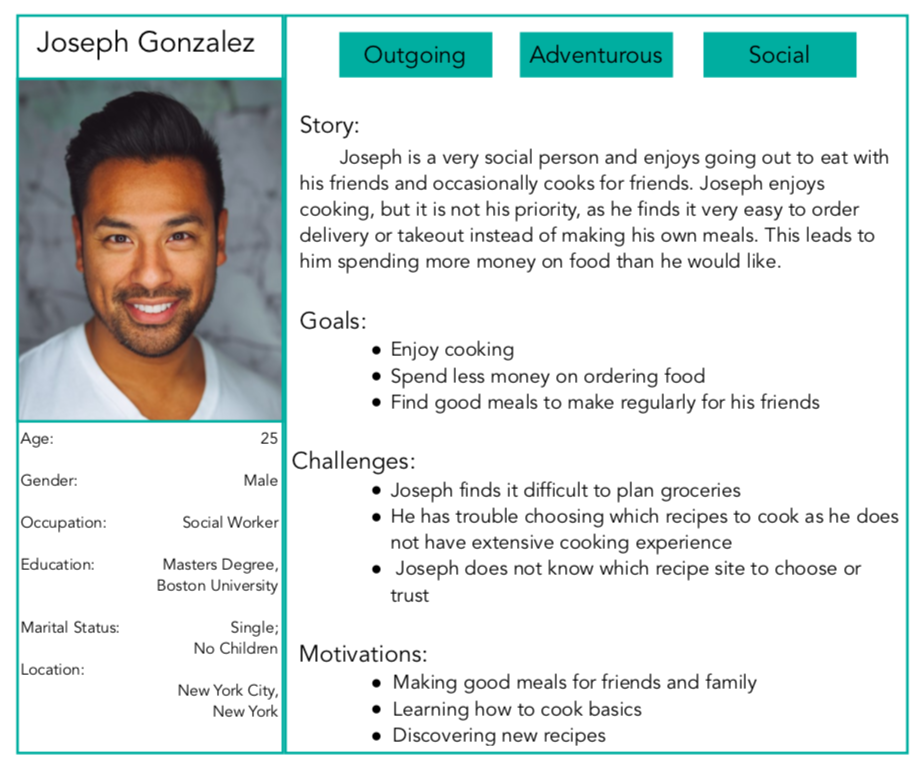
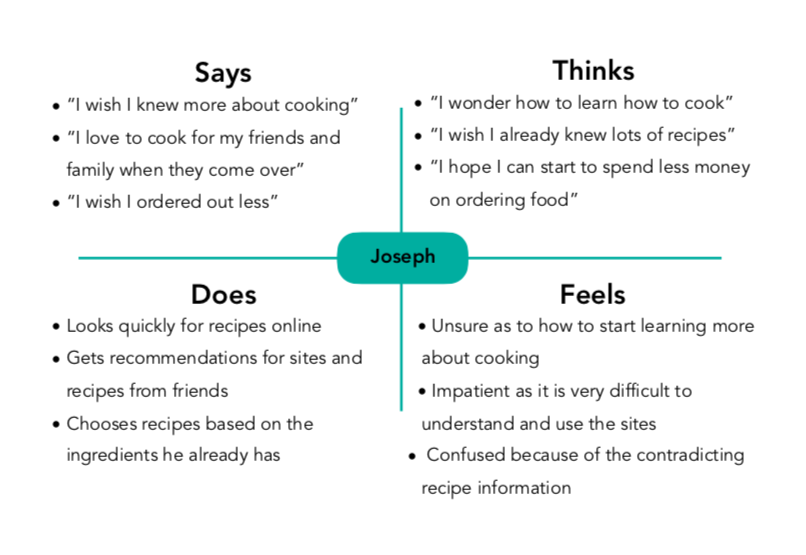
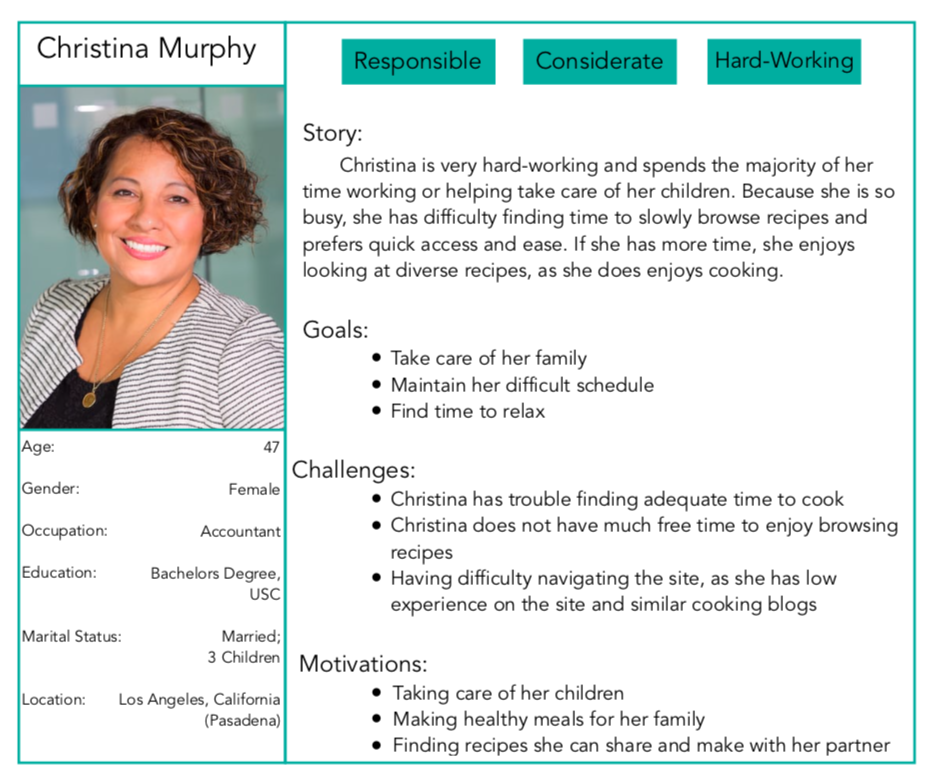
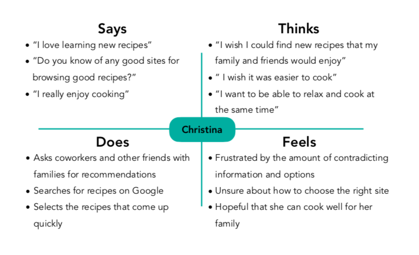
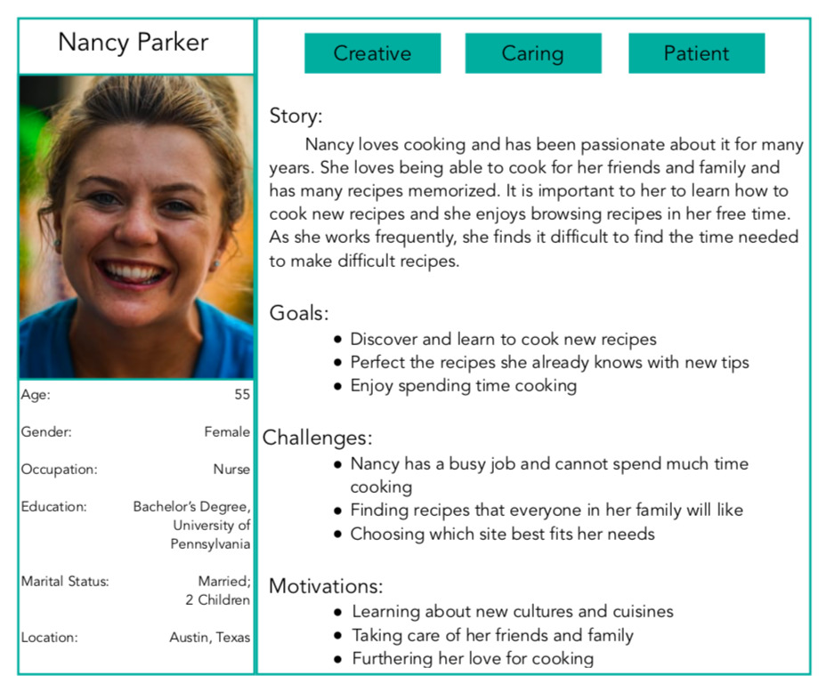
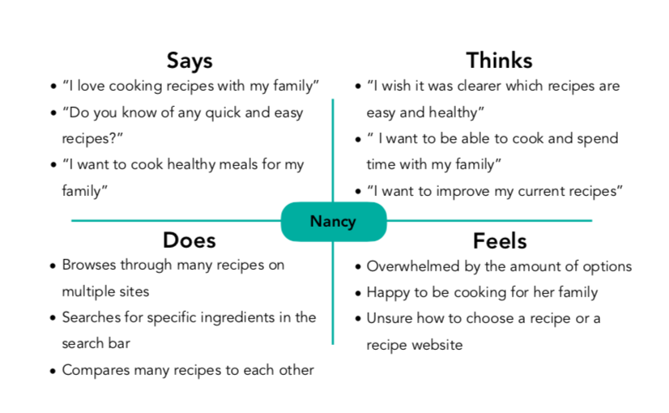
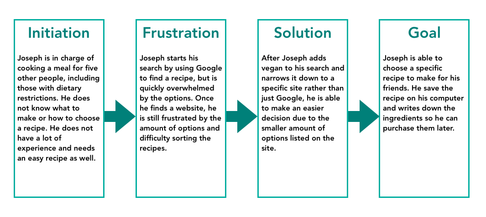
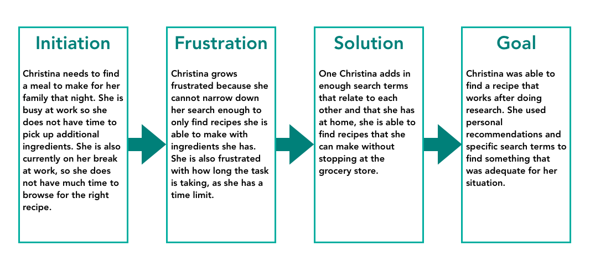
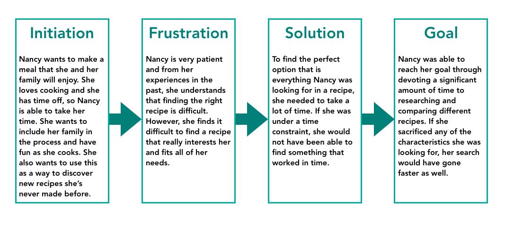

# Personas and Scenarios
## DH150 - Justis Guardia

### Digital Storytelling

Storytelling through user experience is important so the designer can best know their user and understand their goals, priorities, and behavior. In understanding a multitude of different possible personas, more perspectives are gained and used to improve the site. This type of storytelling is very useful for the designer to understand all varieties of user and can help identify ways to make the product better for the users in a very specific way.

### Design Features

After studying The Salty Marshmallow, the features I have identified to implement or improve are:
The Search Bar
The Layout and Organization
The Interactivity
## Personas and Empathy Maps
### Joseph Gonzalez

### Christina Murphy

### Nancy Parker

## User Scenarios and Journey Maps
### Joseph’s Scenario
* Joseph agreed to cook a large meal for his five friends this weekend. It is already Friday afternoon and they are coming over on Saturday night. He has experience cooking, but he does not know what to make. Two of the people coming have dietary restrictions; one of them is vegan and the other is vegetarian. He turns on his computer to browse recipe websites to try and find one that he can easily make that all of his friends will enjoy. Joseph wants to find a recipe that he feels he can easily make and one that does not require many new ingredients.
* Joseph infrequently searches for recipes online, so he does not have any site to go to. He opens Google and types in “easy recipes for dinner.” There are many websites that come up and none of them spark his interest. He adds the word “vegan” to his Google search to potentially narrow down his results. A similarly large amount of sites appear, so he chooses to browse the first one. 
* The first website’s homepage is very crowded with many images of food that looks delicious, but Joseph does not know which of them are vegan. He decides to type vegan into the site’s search bar and see what comes up. There are many meals, but he chooses to click on a few that look particularly delicious because of the images and the description. 
* Joseph finds a few good options and is able to compare the recipes in different tabs of his computer to see which fits his needs the best. He compares the recipes by the ingredients and by the reviews on the site. He finds a good vegan pizza recipe and writes down the ingredients he still needs, making a plan to go to the grocery store later that day. He bookmarks the recipe page and returns to his work.

### Christina’s Scenario
* Christina is currently on a break at her job as an accountant. She is in charge of cooking dinner that night as her partner works later than she does. She decides to browse recipes to see what she can make, as she cannot think of anything she can make with just the ingredients she currently has at home. She is nearby to some coworkers so she asks them if they have any recommendations for websites to find recipes. They recommend a site and she pulls it up on her mobile phone.
* She begins to browse the site looking for recipes that might include only ingredients she already has. She knows that she has pasta noodles, so she types “pasta” into the search bar and finds a wide variety of pasta recipes, but they vary greatly in ingredients. As she is browsing on her phone, it is more difficult to compare each recipe to each other and she is having a difficult time sorting through all of the options. She adds the word “simple” to her search to see if anything easier would come up, and less recipes are returned in the search. In looking at the new recipes, she remembers more ingredients she has at home, like eggs and parmesan, so she includes those in her search. After including all of these additional search terms, she is able to find a recipe for pasta carbonara that she can use tonight for dinner. 
* Christina is still very short on time, so she leaves the page open on her phone so she can refer back to it later. She is not completely sure that she has all the necessary ingredients, so she will use a Google search at home later to see if there are ingredients she can substitute, as it was not listed on the recipe. After doing this, she returns to her break and tries to relax before she returns to work.

### Nancy’s Scenario
* It is the weekend and Nancy has the two days off from work. As she loves to cook, she wants to find a new recipe to try to make that she has never made before. She wants it to be something that her whole family will enjoy to eat, but also a meal that she enjoys cooking. It is the only time during the week that Nancy really has an adequate amount of time to cook for herself and for her family, and she wants to enjoy it by having fun. If she can, she would like to be able to have her children participate in the meal as well, but only if it is possible and safe for her to do so. Also, it would be ideal to make a meal that works as leftovers as well, as that would be very useful for her and her family the upcoming week.
* Nancy is laying in bed with her laptop in the morning and decides to browse a few of her favorite recipe sites to try and find one that she is interested in learning how to make. She has a large pantry and should have all of the necessary ingredients, but she is willing to go to the grocery store for a recipe that she particularly wants to make. 
* She goes to a website that she remembers using before that was successful in the past. Rather than searching for anything in particular, she browses the front page of the blog, looking at the pictures and the titles of the recipes. She opens the recipes she is potentially interested in in a new tab so that she can compare them after she is done browsing. Nancy is really taking her time browsing the site, as she enjoys looking at the options. She notices that there is a tab on the header that says popular recipes, so she clicks on that next to look at recipes that are enjoyed by many people but she is looking in particular for those she has not tried before. 
* Nancy is able to find a recipe that looks delicious, would work for leftovers, she has never made before, and has parts in which her children would enjoy participating. It took her a significant amount of time to find this recipe, but because she enjoys it, she was not bothered by the large time commitment. She closes her laptop to go see if she needs to purchase any ingredients.

