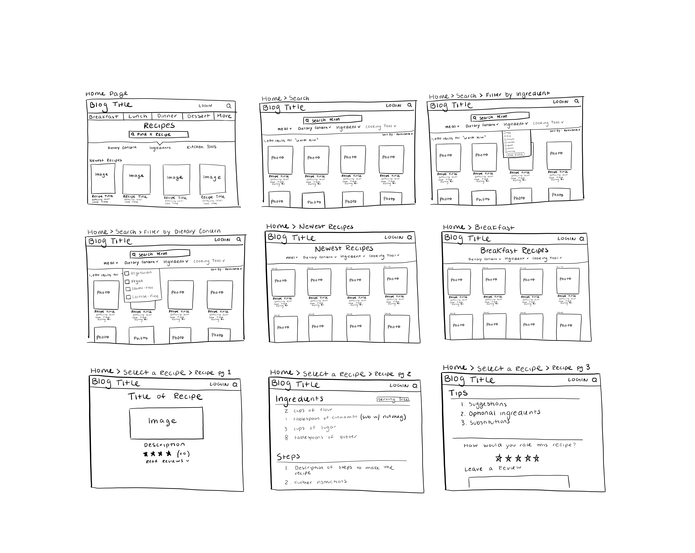
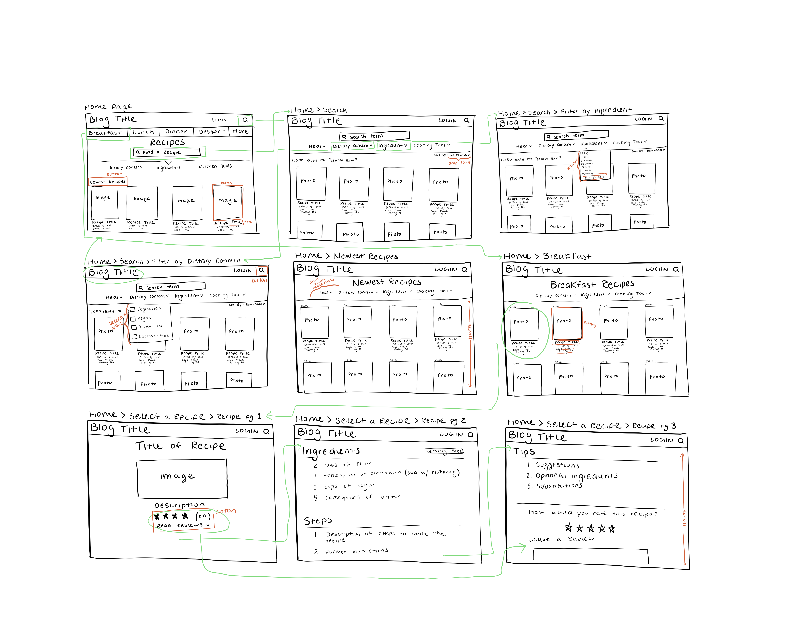
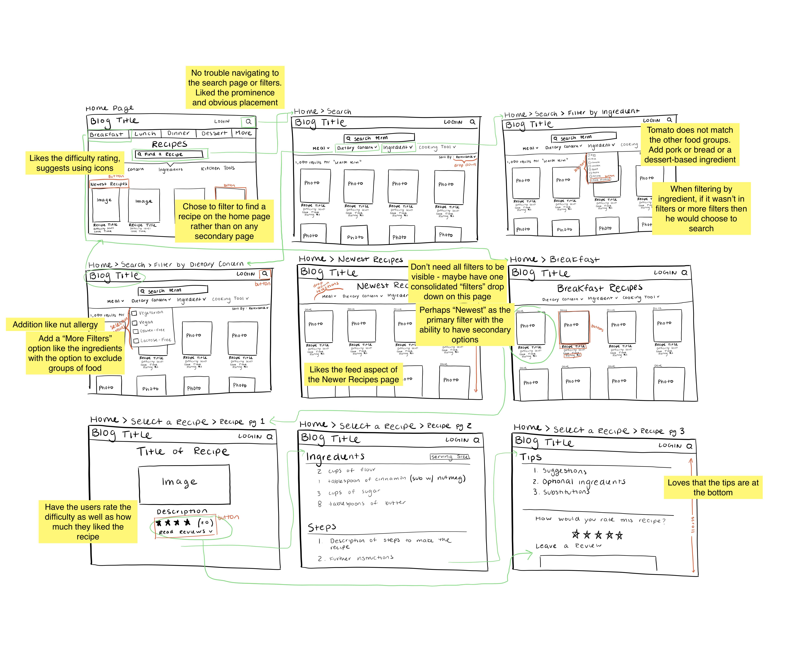

# Low Fidelity Prototype
## DH150 - Justis Guardia
### Description
In this project, I am going to be redesigning the typical cooking blog website, basing my changes on the Salty Marshmallow. I am studying a multitude of the most popular and viewed blogs. As many of them have similar problems, my redesign will be able to improve upon a multitude of sites. Based on my research and studying other users’ on the site, I have determined distinct aspects that are the most frustrating or difficult to use and understand. Through my heuristic evaluation, I learned that a lack of minimalism was a large issue on these sites. Within the usability test, I was able to review the importance of organization both on the home page and on the individual recipe pages as well. Lastly, through user research and an interview, I understood the necessity of brevity and significance of clean and interesting organization. Because of this research, I will be working to create a site that allows for better and more specific search results along with consolidating and streamlining the site. The overarching goal of the redesign is to streamline the process of looking for and browsing recipes to save users time and energy. 

From the findings from my research, I created three personas:

1. Joseph, a social worker with a passion for entertaining who does not know very much about cooking but is interested in expanding his skills for his friends, some of which who have dietary restrictions
2. Christina, an accountant who enjoys finding new, easy, and healthy recipes for her family, despite her lack of time
3. Nancy, a nurse, mother, and wife, who loves and is very knowledgeable about cooking, especially enjoying finding brand new recipes to try

Based on these personas and their goals, I chose features to assist them:
	
1. Filtering recipes by level of difficulty and dietary restrictions for individuals like Joseph.
2. Finding recipes by specific ingredients for someone like Christina who does not have much time to go and purchase extra ingredients.
3. Browsing popular and well-reviewed recipes on the site, so that someone like Nancy can enjoy looking for new recipes.

The purpose of these low-fidelity prototypes is to take the new introductions to the site and see if a user can navigate through the proposed organization, testing the functionality and ease in particular. I can then identify the issues and additions that the user proposes. I will then be able to alter and revise the prototype before going further with the prototype. 

### Tasks Supported by Prototype

1. Filter Recipes by Cooking Materials, Level of Difficulty, and/or Dietary Restrictions
2. Finding a Recipe by Specific Ingredients
3. Browsing Popular/Well-Reviewed Recipes on the Site

### Wireframe

[Here](https://drive.google.com/file/d/1SAxC6wc5XFpBPR3RA0NLo5b6VGn0xhfS/view?usp=sharing) is a link to the wireframes as well.

### Wireflow

### User Interaction

### Conclusion
Through this task I was able to try to put myself in a user's perspective and design the site to best suit the needs of those that will be most using the site. Because of this, I decided to prioritize searching for recipes based on certain filters and criterea instead of the typical layout that focuses on users that will be casually browsing through many recipes. Through my research, I learned that many individuals rely on cooking websites to be consice and easy to navigate, as they typically are using it just for the one recipe and may leave. The goal with my design is to have an involved user-rating system and a very simplistic design aimed at getting users to return to the site. 

#### Successes:
Task 1: Found the filtration options very useful. Likes the ability to filter on the home page or on the search page. Also likes the ingredient filter options. Really enjoyed the prominence of the difficulty filter.

Task 2: Similar successes to the previous filtration task. Enjoyed the clean design and ability to easily identify the filters and available options. 

Task 3: Enjoys the ability to scroll with a feed and browse casually on the newest recipes page. Really enjoyed the filtration options available. 

#### Problems:
Task 1: Suggested that if the difficulty filter is decided by the author or chef, it will seem to users as biased by someone with extensive cooking experience. Proposed allowing users to rate the recipe on its difficulty as well.

Task 2: Wanted the ability to exclude certain groups of food.  

Task 3: There was a slight issue in which the user was unable to quickly find the "Newest Recipes" button or page. This would be solved through color and font choices. The user suggested consolidating the browsing section into a general recipes section with a primary filter option to choose either "Sort by New" or "Sort by Most Popular," etc. 

#### Changes and Notes:
Because of the information I received from the user testing of my wireframes, I have decided to make minor changes on some of the pages. I need to make it more clear where you can scroll and in what direction. I want to edit some of the filter options I currently have, additionally changing the filter organization on pages designed for more casual browsing. I believe that the user's idea to consolidate the browsing pages to have primary and secondary filters would be very useful. I will change the site to reflect that and so that selecting the "Newest Recipes" button will take you to the consolidated page with the "Sort by New" filter already selected. One of the additions that recieved the best review was moving the "Tips" section on the specific recipe pages to the bottom. About this, the user said "it is nice get to the necessary steps first, and then the fluff." They discussed how, when cooking and shopping, it is better to have the most important information at the top of the page as "the less you have to touch and interact with it to get to the recipe, the better"
