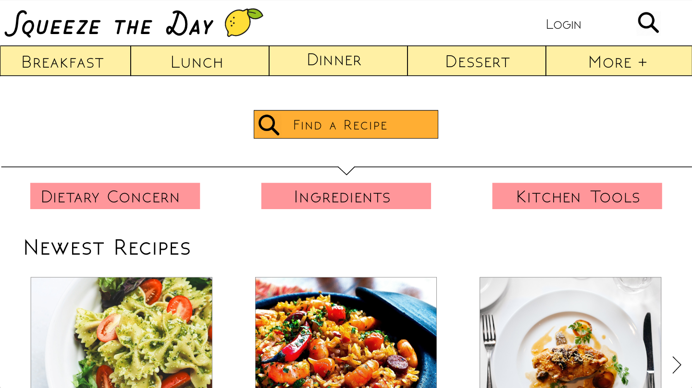
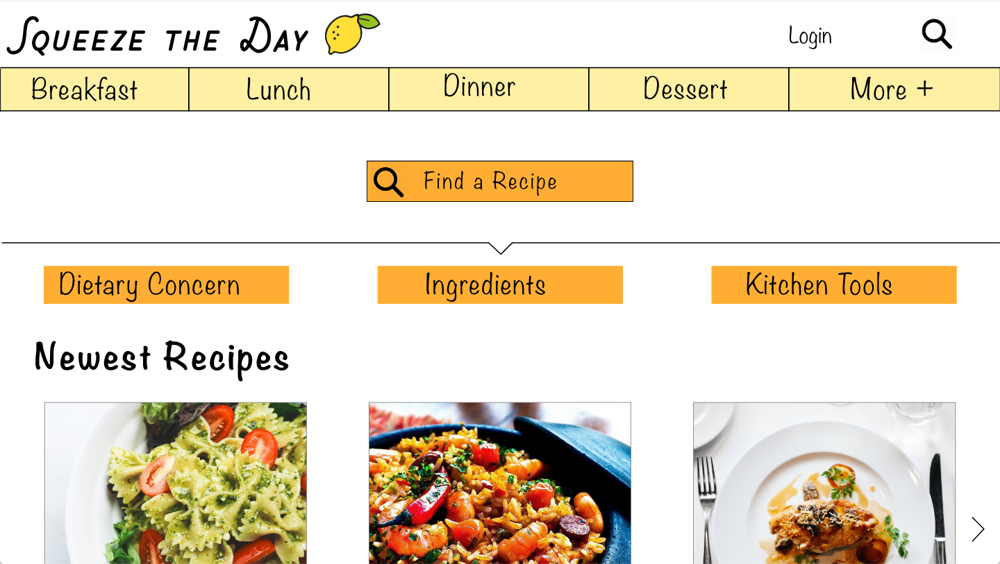
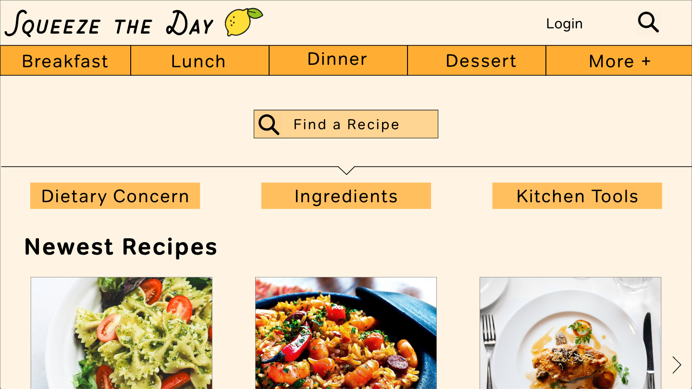
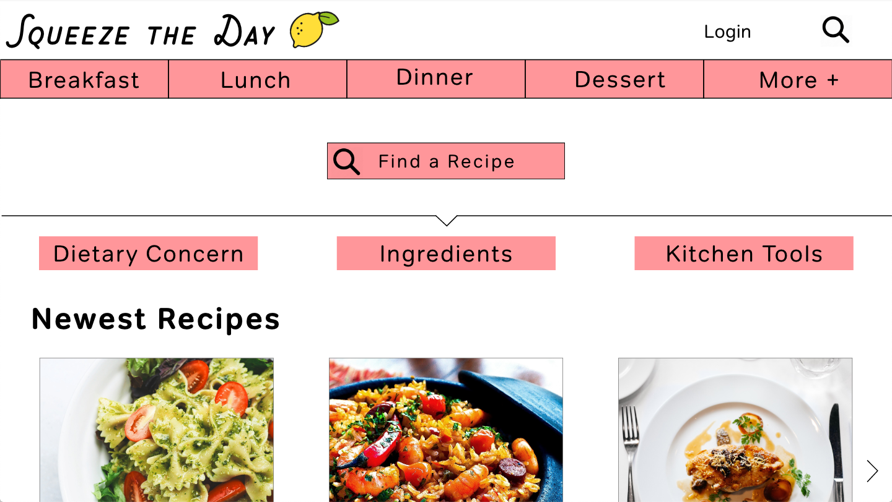

# High Fidelity Prototype
## DH150 - Justis Guardia

### Graphic Design

#### Low-Fidelity Prototype Review

Based on my usage-scenario experience, I have decided that having a very strong home page and search bar and results are some of the most important parts of a useful and well-liked cooking blog. I have also chosen to include a page that is designed for individuals wanting to browse recipes as well. I have also learned through my research that the design on the specific recipe pages are very important to allow users to understand the site and keep their information organized.

The distinctive screen designs I have chosen are:
1. The Home Page
2. The Search Page
3. The Newest Recipes
4. The Specific Recipe Page

#### Color, Typography, and Design Options

As this is a recipe blog, when choosing the color-scheme and typography, I prioritized bright and energetic colors. However I needed to make sure that the design was very clean and organized, as that is an important part of a website designed to provide information. In regard to typography, I needed a font that is fun to match the color scheme and feeling of the website, but I also needed to choose one that was extremely legible, even from a distance. After multiple options, I chose Tondo for the majority of text on the website with Chippewa Falls for the title of the blog. My main goal in the design of the blog is to keep it very concise and clear, with an emphasis on minimalism, as those are one of the biggest problems with cooking blogs presently. 

#### Typography Tests

#### Color Tests

### Impression Test

### Accessibility Test
