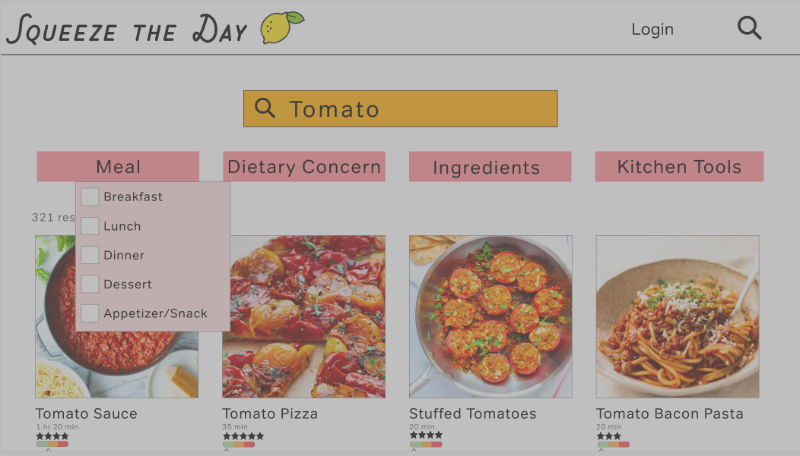

# High Fidelity Prototype
## DH150 - Justis Guardia

### Prototype Link
Please find the current version of my prototype [here](https://xd.adobe.com/view/96e004fc-d942-4649-86ad-a95e3e0938cd-c3b3/).

### Graphic Design

#### Low-Fidelity Prototype Review

Based on my usage-scenario experience, I have decided that having a very strong home page and search bar and results are some of the most important parts of a useful and well-liked cooking blog. I have also chosen to include a page that is designed for individuals wanting to browse recipes as well. I have also learned through my research that the design on the specific recipe pages are very important to allow users to understand the site and keep their information organized.

The distinctive screen designs I have chosen are:
1. The Home Page
2. The Search Page
3. The Newest Recipes
4. The Specific Recipe Page

#### Color, Typography, and Design Options

As this is a recipe blog, when choosing the color-scheme and typography, I prioritized bright and energetic colors. The colors I chose in particular are inspired by the colors of fruit. I chose to not only use bright colors, and use white as my background and black for the majority of my text to have high readability and accessibility, while still having an interesting and colorful as possible. However I needed to make sure that the design was very clean and organized, as that is an important part of a website designed to provide information. In regard to typography, I needed a font that is fun to match the color scheme and feeling of the website, but I also needed to choose one that was extremely legible, even from a distance. After multiple options, I chose Tondo for the majority of text on the website with Chippewa Falls for the title of the blog. My main goal in the design of the blog is to keep it very concise and clear, with an emphasis on minimalism, as those are one of the biggest problems with cooking blogs presently. 

#### Typography Tests

#1

#2

#3

#### Color Tests

#1

#2

#3

### Impression Test
[Here]() is a screen recording of my first impression test on this version of the prototype.

Through this test, I was able to identify some issues with the current version of my website, along with some additions and inclusions that were said to be an improvement on cooking blogs, according to the individual testing the site.  For example, the user 

### Accessibility Test
Because of the importance of readability on this type of website, I utilized a large amount of black text on the white background. This was a successful color combination when checking it on accessibility and color contrast sites. 

Here are screenshots of color contrast checks with the other colors I utilized behind some of the text on the website:

To continue checking accessibility, I also analyzed the site through browser extensions that imitate what it would look like for color blind users with various types of color blindness.

Here are screenshots of these tests as well:

#1 Protanopia

 

#2 Achromatopsia

#3 Low-Contrast

Through these tests, I was shown that choosing high contrast colors is extremely important. I found it extremely interesting to look at what the site would look like low-contrast specifically. There are many various cooking conditions in which the screen would be much more difficult to see, such as outdoors, so making sure that even with a low-contrast filter, the text is completely visible. I did realize, however, the importance of having the photos included on the site be high-contrast as well. The description of the recipes being visible is extremely important, but to fully give the user all the necessary information, having very clear images is required. It is also essential for accessibility to have well-written descriptions of the photos and concise recipes generally, for those who have further eyesight disabilities. 
