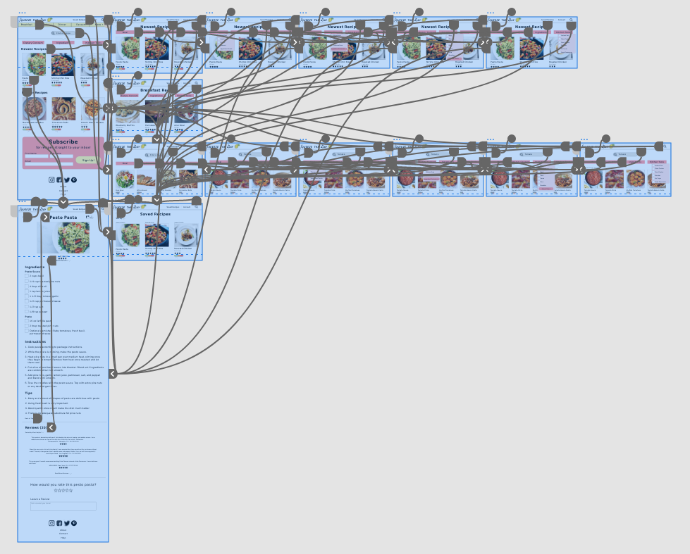

# High Fidelity Prototype
## DH150 - Justis Guardia
### Prototype Link
Please find the current version of my prototype [here](https://xd.adobe.com/view/96e004fc-d942-4649-86ad-a95e3e0938cd-c3b3/?fullscreen&hints=off).

Further information on this high fidelity prototype can be found [here](https://github.com/justisg/DH150-JustisG/blob/main/DH150-Assignments/Assignment07-02/README.md).

### Summary
This interactive prototype is designed to solve common problems found in the design and organization of modern cooking blogs. This includes simplicity, minimalism, and clarity. Through the design of this prototype, I have prioritized flow and organization, so as to minimize confusion and the other similar issues I found through interviews. 

### Design
More information about the design process can be found on the page linked above, including color, typography, and accessibility, however since that version of the prototype I have edited a few aspects of the design. In particular, I changed the design of the search bar in the center of the home page and the search page. From comments from other students in the class, I was made aware that the search bar looked more like a button, and as such might lead users to not understand its function at a quick glance. Because of this, I changed it to look more like a traditional search bar to hopefully improve the usability. I also changed the phrasing of the subscription box on the home page to help with the readability of that aspect. 

### Tasks
The tasks I chose to complete were based on the 3 users and user scenarios I created, found [here](https://github.com/justisg/DH150-JustisG/blob/main/DH150-Assignments/Assignment05/README.md).

1. Filter Recipes by Cooking Materials, Level of Difficulty, and/or Dietary Restrictions
2. Finding a Recipe by Specific Ingredients
3. Browsing Popular/Well-Reviewed Recipes on the Site

### Interactions Supported by the Prototype
1. Browsing new recipes
2. Searching and filtering your search by meal, dietary restrictions, ingredients, cooking tools
3. Viewing a specific recipe page
4. Looking at recipe reviews

A user looking for a specific recipe is able to land on the home page, and use the search bar to filter by different information, allowing for them to receive their ideal results much quicker. The listed recipes include information like the current rating from other users and the difficulty rating, so inexperienced cooks know which recipes are easier to complete successfully. After finding a recipe they are interested in, they are able to click on it, view all of the necessary information very quickly and concisely, so if the page refreshes or you are unable to touch your device, it is extremely clear and minimalist. If the user has an account, the recipe can be added to saved recipes as well. On the same page, you are also able to add a review and read other reviews. A user could also navigate back one page and continue browsing for more recipes. 

### Wireflow
Here is a screenshot of the many wireflows and interactivity options within the prototype. 

Through feedback from fellow students, I added back buttons to every page that allow the user to return to the previously viewed page in the prototype. I also added more pages to the site and edited the wireflows to reflect that. In particular I added a “Saved Recipes” page which is accessible from every page. In my original prototype, the header said “Log In,” but this version of the prototype assumes that the user is already logged in, as this would give them access to their saved recipes. 

### Cognitive Walkthrough
A screen recording of this cognitive walkthrough can be found [here](https://drive.google.com/file/d/1_n6fUx_FUhb0AyuXs8W-k2GIWGCsxCcK/view?usp=sharing).

Through this cognitive walkthrough, I was able to see that the majority of the pages on the site is very consistent and understandable. Some specific comments from the user were “”. After this walkthrough, I edited _______. This changes are made available in the linked version of the prototype.

### Reflection
