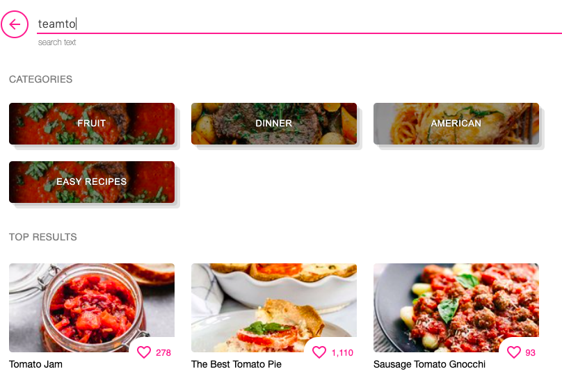
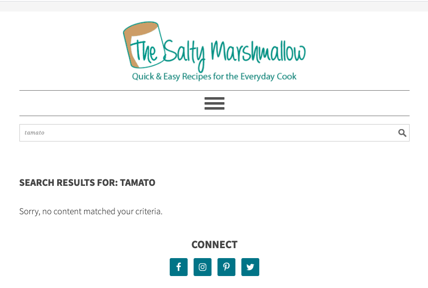

# Cooking Blogs and Storytelling
## Justis Guardia - Digital Humanities 150
Cooking blogs and websites are incredibly popular, especially within the demographic of middle-aged women, as they should provide easy access to recipes of all skill levels and with a variety of ingredients. The personal blogs, rather than the food or recipe companies, also allow readers to provide a personal connection to their author through enjoying their recipes and seeing their images. Unfortunately, these pages can become overrun with personal anecdotes and unnecessary details, drastically increasing both the amount of time needed to find a useable recipe and the difficulty in understanding the primary steps. Through my analysis and subsequent design, I hope to provide alternative options for the way these blogs are set up, to benefit both the authors and the readers. 

## The Recipe Critic

https://therecipecritic.com/

### Description
This recipe blog was started by one individual in 2012. Currently, it reaches over 10 million readers per month, more than 300,000 daily readers, and significant followings on major social media sites. Additionally, the site has been featured in many major news publications and has worked alongside very popular brands. 

### Evaluation
Because of the large user-base of this site, the errors are much more important. Specifically, the fact that there are tabs on the homepage that do not lead anywhere is extremely detrimental. The simplicity of the site's goals means that it is still useful despite the problems and the core tasks can be accomplished, however, the web design should be improved to further expand their users and improve the site's functionality.

### 10 Heuristics
#1: Visibility of System Status

This site has a complete lack of any interactivity from the user, which I would argue is necessary for a useful recipe website. Despite frequent uploads from the author, there is no clear schedule or easily accessible information on new posts without following on additional social media sites. There is also no option to sign up for emails to get notified when there is a new recipe. A user can create an account, however this option is only made clear when they try to favorite a recipe for the first time. This lack of information and clarity definitely would lead to a lower amount of users with accounts.
**Severity Rating**: 2/3

#2: Match Between System and the Real World

The order in which recipes are listed on the home page and all other categories follows no logical order. On the current front page of the site, the four categories listed are "Appetizers," "Soup Recipes," "Dinner," and "Desserts." Three out of four of these are similar, however the seemingly random included categories are disorienting and make it more difficult to navigate.
**Severity Rating**: 1/3

#3: User Control and Freedom

There is an option within the header to search "by ingredient," however selecting that does not take you to a new page. The same happens when the nearby "by cooking type" option is selected. Interestingly, when using the search bar, a user can to search "by ingredient," but that ability is not made evident anywhere until it is discovered by accident.
**Severity Rating**: 2/3

#4: Consistency and Standards

The language used on this site is very consistent and easily understandable. However, as this site is typically used infrequently and users might view only one recipe, the infrequent defining of equipment or specific cooking techniques can be difficult. The lack of frequent definitions might force a reader to need to look up meanings on another website, decreasing efficiency and ease. Additionally, the naming of recipes is extremely varied, with some being just the simplest name of the dish and others including descriptive words like "super easy," "my favorite," and "melt in your mouth." These terms can be useful for readers, but the inconsistency makes it more difficult to compare recipes to each other.
**Severity Rating**: 1/3

#5: Error Prevention

As seen in the above image, within the search, the error prevention is fairly useful and successful. Specifically, when misspelling ingredients or search terms, the majority of the time the site would be able to assume what was meant and show relevant search results. 
**Severity Rating**: 0/3

#6: Recognition Rather than Recall

Many of the categories on this site are incredibly broad, and therefore when a user is aiming to find a recipe without any prior knowledge or idea of what they are looking for, they are forced to recall information. The images are useful, however it would be simpler for further categories within such large options. For example, within the dinner page, having more categories like "pasta," "salad," or "meat" to further narrow down the choices.
**Severity Rating**: 2/3

#7: Flexibility and Efficiency of Use

Within this site, a user cannot grow in their knowledge as there are no options for advanced settings or algorithms that take what you have viewed or saved in the past and recommend you new recipes. The only available customization is a user creating an account, which is an option only found through trying to save a recipe for the first time, and then saving recipes they find to their account. Expanding the options on The Recipe Critic would help to improve the flexibility and efficiency of the site.
**Severity Rating**: 2/3

#8: Aesthetic and Minimalist Design

As this site is solely about food, the constant inclusion of images is very useful and helpful to the user. However, there is a significant amount of information on each page of the site that is unnecessary and clutters the page, making it very busy. Similar to the addition of descriptive words in the recipe titles, there is a lot of included information that is irrelevant and should instead allow for further text through the selection of certain buttons or possibly even hovering over the image. 
**Severity Rating**: 2/3

#9: Help Users Recognize, Diagnose, and Recover from Errors

When a non-existent URL attached to The Recipe Critic is used, it shows an error page that states "Nothing Can Be Found" and "Perhaps searching can help" and then provides a search bar. This is very helpful to the user and allows for quick error correction. No distracting images are found on that page as well. The error message is very clear and indicates what the user needs to do.
**Severity Rating**: 0/3

#10: Help and Documentation

This site does not have any sort of help page or information about how to navigate it well. Despite the site being relatively simple, this is an important aspect. There is a contact form and email to get help if needed, but there is no option for the user to figure it out themselves, without simple trial and error.
**Severity Rating**: 2/3

## The Salty Marshmallow

https://thesaltymarshmallow.com/

### Description
The Salty Marshmallow is also a recipe blog started by one person, Nichole, posting information about meals and desserts. Nichole runs the blog with her husband Dan as the web designer. She has worked with many large brands and news sites, and has significant followings on social media sites as well, specifically Facebook.

### Evaluation
This site has a significant amount of web design problems, with the most obvious being an overwhelming amount of information on each page, and a lack of error prevention. This site does allow for more interaction than others, in the form of an email sign up in conjunction with commenting, but there is difficulty finding certain aspects of the site because of the design choices.

### 10 Heuristics
#1: Visibility of System Status

Like many of these similar blogs, there is very little interactivity, other than the ability for users to comment on or save recipes. The Salty Marshmallow does allow for users to sign up for weekly emails for updates on posted recipes.
**Severity Rating**: 2/3

#2: Match Between System and the Real World

The language used is very user-friendly and accessible. For example, to promote readers to sign up for the weekly emails, it states "Love food as much as we do?" which is a much more relevant and enticing way to connect to the users, rather than a more analytical explanation. 
**Severity Rating**: 0/3

#3: User Control and Freedom

There is no ability to input specific ingredients, equipment, or information that would lead to a better match with a recipe. There is also no way to exclude recipes by lack of items. The search does allow for specificity in categories and when it was posted, but there is no option for searching by ingredient. 
**Severity Rating**: 2/3

#4: Consistency and Standards

The site has consistent simple design on all pages, with the same header and footer, but like the previous blog, there is a lack of consistency in titles and ordering of the individual recipes. There is a significant amount of descriptive language, with some being completely useless in their description of the recipe. 
**Severity Rating**: 1/3

#5: Error Prevention

This website has a large problem with typos in the search bar. As seen in the above image, when a word is misspelled by one letter, no recipes or suggestions appear. 
**Severity Rating**: 3/3

#6: Recognition Rather than Recall

The categories on this site are simple and ordered well, and providing users the ability to narrow the categories down further is very useful. Providing clear options increases the ease of use of this site significantly, despite an overwhelming amount of options. 
**Severity Rating**: 0/3

#7: Flexibility and Efficiency of Use

This site is flexible and efficient in its simplicity, but the more time spent on the site, the more frustrating the navigation becomes. The large amount of content and information on each page becomes overwhelming when searching for something like a contact form, but if a user is aiming to just browse recipes, this site is useful and efficient.
**Severity Rating**: 2/3

#8: Aesthetic and Minimalist Design

This website is not minimalist at all, with every page containing a significant amount of images and descriptive text. For example, at the bottom of every page on the site, below the "Connect" and "About Me" sections are a list of the most popular recipes with images. There are eight recipes in this section, and they are very unnecessary. Additionally, the images attached are blurry, and the placement of these recipes on the page are not helpful for users.
**Severity Rating**: 3/3

#9: Help Users Recognize, Diagnose, and Recover from Errors

The error page has much more technical language than any of the other aspects of the site, but it does provide options to fix the problem, with a suggestion to search or return to the homepage with a hyperlink. When a search returns no results, there is no helpful information or suggestions, unlike the error page, which makes it more difficult for users to recover from a simple typo.
**Severity Rating**: 2/3

#10: Help and Documentation

The Salty Marshmallow does not have a help page, also forcing a user with a problem to contact the site directly. The contact form is also hard to find, as it is within the "About Me" section. 
**Severity Rating**: 1/3
